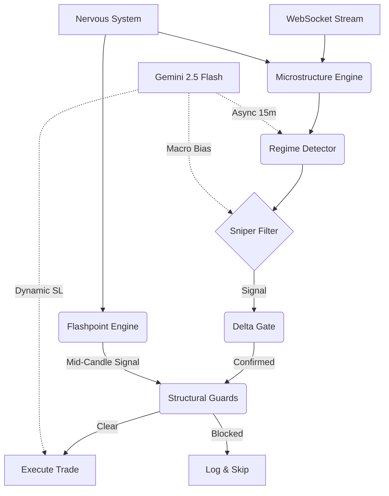

# VEBB-AI

[](https://www.python.org/downloads/)
[](https://www.binance.com/en/futures)
[](https://ai.google.dev/)
[](LICENSE)

A real-time, regime-adaptive algorithmic trading system for BTC perpetual futures, combining deterministic quantitative logic with asynchronous LLM-driven macro intelligence.

VEBB-AI operates as a hybrid execution engine: a high-frequency deterministic core handles sub-second order flow analysis and trade execution, while Gemini 2.5 Flash runs asynchronously as a background parameter server — tuning macro bias, position sizing, and risk parameters without blocking the critical path.

## Architectural Overview

The system is structured as a multi-layer pipeline, where each candle triggers a deterministic execution cascade.



### Core Components
1.  **Nervous System (Rust/SHM)**: A Rust-based data ingestor feeds tick-level market data through shared memory (POSIX SHM) at microsecond latency, bypassing Python's GIL entirely.
2.  **Microstructure Engine**: Computes Hawkes process intensity (λ), Kyle's Lambda, OFI, iceberg detection, and absorption probability from raw trade flow.
3.  **Regime Detector (HMM)**: Hidden Markov Model classifies market state into 5 regimes (NORMAL, HIGH_VOL, CRISIS, TRANSITION, RANGE) using Garman-Klass volatility Z-scores and rolling Hurst exponents.
4.  **Asynchronous LLM Layer**: Gemini 2.5 Flash operates off the critical path as a background macro strategist, updating bias, hysteresis multipliers, and dynamic stop-loss parameters every 15 minutes.

## Performance Engineering

The deterministic core is engineered for latency-sensitive execution on 15-minute BTC perpetual futures.

*   **Data Ingestion**: Rust ingestor → POSIX Shared Memory → Python bridge. Zero-copy IPC eliminates serialization overhead.
*   **Event Loop**: `uvloop` replaces the default asyncio loop for 2-4× throughput improvement on WebSocket message processing.
*   **Hawkes Process**: Real-time Bayesian self-calibrating intensity estimation with trapezoidal integration and a 24-hour rolling normalization buffer.
*   **Delta Gate**: Dynamic confirmation threshold (Θ) derived from a Bayesian sparsity gate — eliminates all hardcoded tuning constants.
*   **Exit Framework**: ATR-scaled, regime-adaptive TP/SL with Bayesian Kelly Criterion integration. Enforces 0.80% max SL (75× leverage ceiling) and 0.25% min TP (fee-floor breakeven).

## Signal Generation Pipeline

Five independent entry pathways feed into a unified structural guard layer:

| Entry Pathway | Trigger | R:R Profile |
|:---|:---|:---|
| **PoNR Expansion** | Value Area boundary cross + 50k intensity spike | Moderate (2:1) |
| **Lead-Lag Alpha** | SOL leads BTC by Theta ≥ 2.5 (Sentinel Detector) | Tight (2:1) |
| **Trend Breakout** | Delta > Θ(dynamic) + GOBI > 0.1 | Wide (3-4:1) |
| **Mean Reversion** | DISCOUNT/PREMIUM + VWAP extension + OBI alignment | Compressed (1.5:1) |
| **Flashpoint** | Mid-candle autonomous entry via Nervous System SHM | Aggressive (2.5:1) |

### Structural Guards (Pre-Execution Vetoes)
- **Spoofing Guard**: Hollow wall detection (Top OBI vs. Macro OBI divergence)
- **Dynamic Volume Veto**: Phase 91 regime-scaled delta imbalance shield
- **HTF Lead-Lag Veto**: Blocks entries against dominant cross-asset flow (SOL→BTC theta)
- **Exhaustion Guard**: Passive absorption detection with macro bias override
- **Fee-Floor Subordination**: Intensity-based exits suppressed below 0.25% breakeven

## Directory Structure

```bash
├── main.py                  # Core Orchestrator (~3000 lines)
├── dynamic_tp_sl.py         # Phase 107: Regime-Adaptive TP/SL Framework
├── delta_threshold.py       # Bayesian Self-Calibrating Sparsity Gate
├── microstructure.py        # Hawkes Process, Kyle's Lambda, OFI
├── gemini_analyst.py        # Async Gemini 2.5 Flash Integration
├── order_flow.py            # Footprint Builder, Volume Profile
├── order_book.py            # Order Book Imbalance (OBI) Engine
├── regime_detector.py       # HMM Regime Classification
├── position_manager.py      # Position Tracking & Risk Management
├── exchange_client.py       # Binance Futures API Client
├── sentinel_detector.py     # Cross-Asset Lead-Lag (SOL→BTC)
├── liquidity_magnet.py      # Liquidation Cluster Detection
├── data_stream.py           # WebSocket Stream Manager
├── vebb-ingest/             # Rust Data Ingestor (SHM Bridge)
├── vebb-core-cpp/           # C++ Execution Core (SPSC Queue)
├── Deep Research/           # 38 Research Documents (Math Derivations)
└── .env.example             # Configuration Template
```

## Installation

Requires Python 3.10+, Rust (for the ingestor), and a Binance Futures account.

```bash
git clone https://github.com/AbeneilMagpantay/VEBB-AI.git
cd VEBB-AI

# 1. Install Python Dependencies
pip install -r requirements.txt

# 2. Build Rust Ingestor (optional, for SHM bridge)
cd vebb-ingest && cargo build --release && cd ..

# 3. Train HMM Regime Model
python train_15m_hmm.py
```

## Configuration

Configure environment variables in a `.env` file:

```ini
BINANCE_API_KEY=your_binance_key
BINANCE_SECRET=your_binance_secret
BINANCE_TESTNET=false
GEMINI_API_KEY=your_gemini_key
initial_capital=200.0
leverage=75
max_position_pct=1.0
daily_loss_limit_pct=0.15
```

## Usage

```bash
# Run the live trading bot (15m timeframe)
python main_instance.py
```

### Key Log Indicators
- `📊 Phase 107 TP/SL:` — Dynamic exit bounds per trade
- `🎯 SNIPER ENTRY:` — Sniper filter signal with Value Area context
- `⚡ AUTONOMOUS SOTA ENTRY:` — Lead-lag alpha execution
- `🌋 LOGISTIC EXHAUSTION EXIT:` — Hawkes intensity-driven harvest
- `⏸️ EXHAUSTION SUPPRESSED:` — Fee-floor subordination active

## Disclaimer

This software is for educational and research purposes. Cryptocurrency futures trading involves substantial risk of loss. **Use at your own risk.** The author is not responsible for any financial losses incurred.
